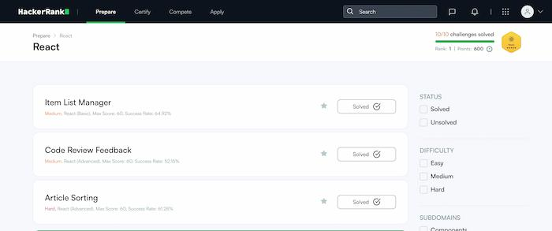

I read that hakerrank has challenges organized by domain — for example, the [React domain](https://www.hackerrank.com/domains/react) — and decided to solve them as part of my interview
preparation.

I completed all of them, but not satisfied. Here's why:
1) **The challenges don’t feel like real interviews**. They give you a lot of
code, while in actual interviews you often write components almost from scratch.
2) **The tests are not reliable**. In one case, I had to remove the `key` from react element just to
make their test pass. Test kept a reference to the element at the start and didn't update it
after re-render.
In another challenge, tests used hardcoded outdated dates, so I had to add a weird condition
just to pass.
3) **The platform itself has issues**. Sometimes my progress wasn’t saved. A couple of times I
submitted a solution, saw the “Congratulations” screen, went back to the challenge list — and it showed the challenge as unsolved. I had to redo the solution. Eventually, I started double-clicking the submit button just in case, because I didn’t want to retype everything again.

Overall, I regret the time spent a little, because mostly I fought with tests, not with
solving problem. Moreover, challenges turned out to be not so interesting. I liked leetcode
experience more.

