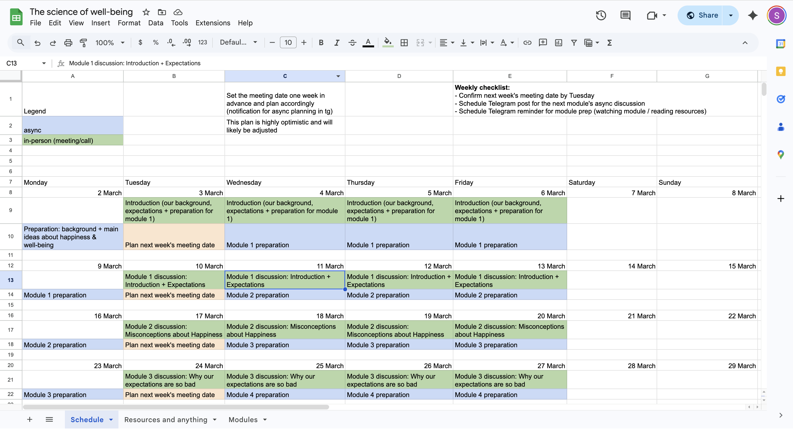

import { Aside } from '@astrojs/starlight/components';

Sometimes I think there’s a frustrated project manager living inside of me. I absolutely love creating spreadsheets (though that doesn't necessarily mean I’m an expert at them!) and planning every little detail.

For example, you can see how seriously I’m approaching my study of "The Science of Well-Being." This is actually my second time taking the course. I finished it last year, but I feel like I need to dive deeper and really research the concepts further this time around.

<Aside>
By the way, here is the [link to the course](https://www.coursera.org/learn/the-science-of-well-being/#modules) — highly recommend it to everyone!
</Aside>